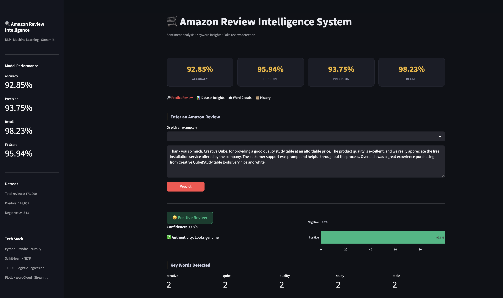
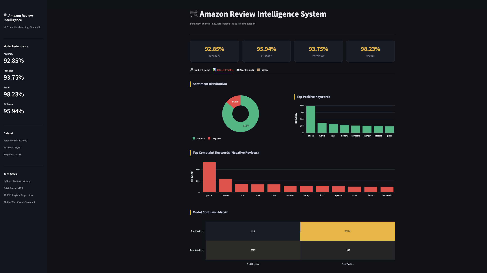
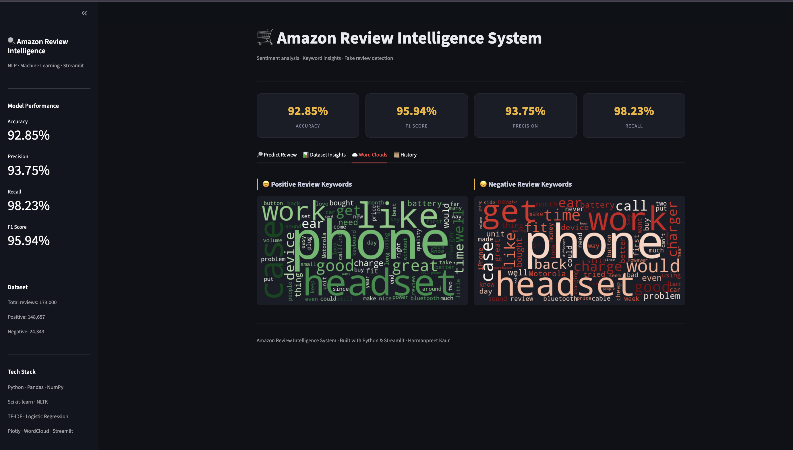
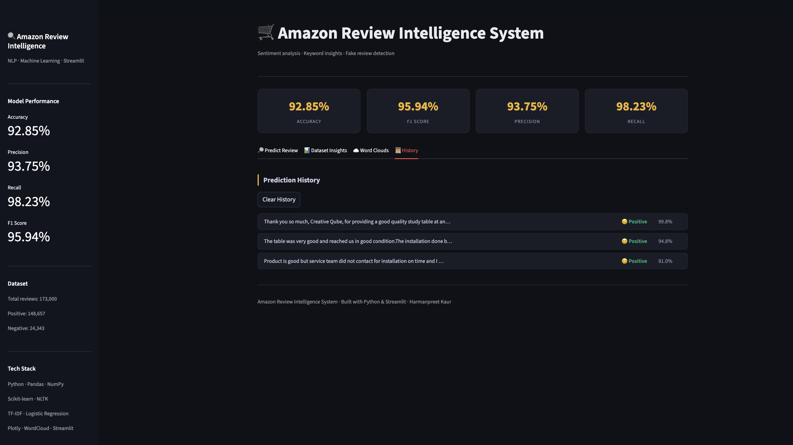

# 🛒 Amazon Review Intelligence System

> NLP-based sentiment analysis system for Amazon product reviews, with keyword insights, fake review detection, and an interactive dashboard.

## 📸 Screenshots

## 📊 Model Performance

| Metric | Score |
|---|---|
| Accuracy | 92.85% |
| Precision | 93.75% |
| Recall | 98.23% |
| F1 Score | 95.94% |
| Dataset | 173,000 real Amazon reviews |

## 🛠 Tech Stack
Python · Pandas · Scikit-learn · NLTK · TF-IDF · Logistic Regression · Streamlit

## 🚀 How to Run
pip3 install -r requirements.txt
python3 -m streamlit run app.py

*Built by Harmanpreet Kaur | Amazon ML Summer School 2026*
